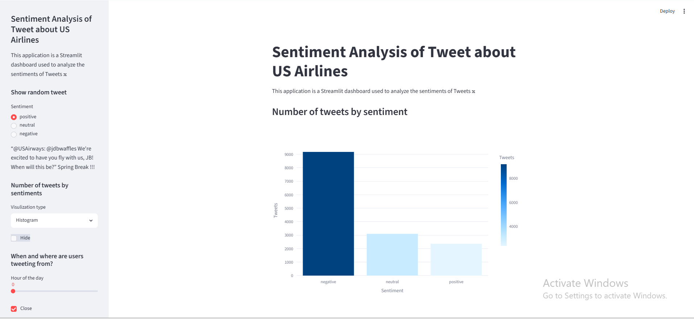
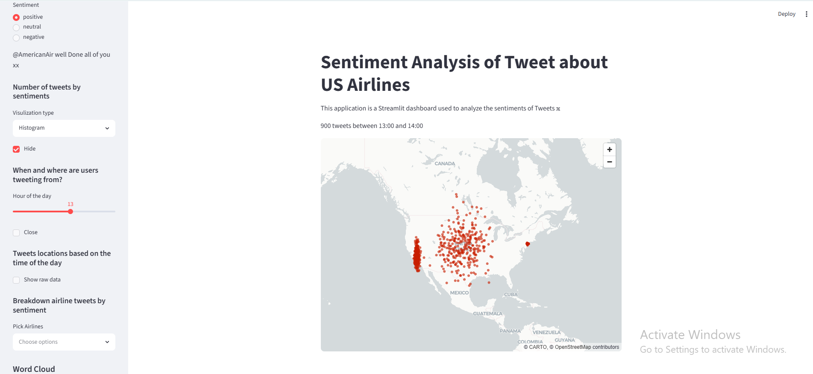
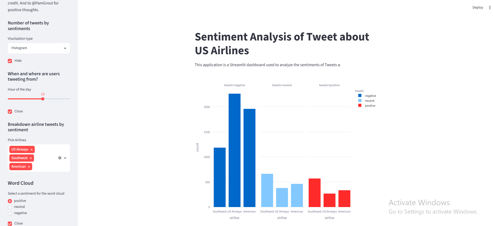
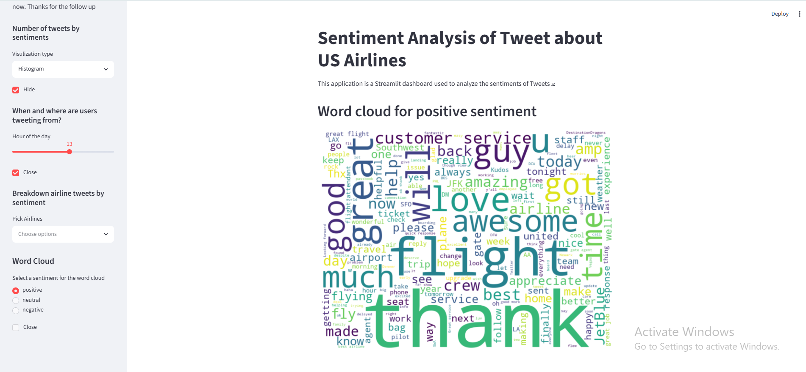

# 🛫 Airline Sentiment Dashboard

> **Interactive Data Visualization & Sentiment Analysis Platform for US Airlines Twitter Data**

[](https://www.python.org/)
[](https://streamlit.io/)
[](https://opensource.org/licenses/MIT)
[](https://github.com/AbdulRehman393/streamlit-airline-sentiment)

---

## 🎉 Live Demo

**🚀 [Try the Live Application Here!](https://app-airline-sentiment-8mwwconsnxvhqrfy6yhicz.streamlit.app/)**

The application is now deployed and live. Click the link above to explore the interactive dashboard!

---

## 📋 About

This is a **modern, interactive web application** built with Streamlit and Python that provides deep insights into customer sentiment across major US airlines through Twitter data analysis. The dashboard offers real-time sentiment visualization, geographic tweet distribution, airline comparison analytics, and word cloud generation—all in an intuitive, user-friendly interface.

Perfect for **data analysts, business intelligence professionals, and anyone interested in social media sentiment analysis**, this tool transforms raw tweet data into actionable business intelligence about customer satisfaction and airline performance.

---

## ✨ Key Features

### 🎯 **Core Capabilities**

- **📊 Sentiment Distribution Analysis**
  - Visualize tweet counts across positive, neutral, and negative sentiments
  - Toggle between histogram and pie chart visualizations
  - Real-time sentiment metrics and statistics

- **🗺️ Geographic & Temporal Analysis**
  - Interactive map showing tweet locations by time of day
  - Hour-based filtering (0-23 hours)
  - Identify peak tweeting patterns and geographic hotspots

- **✈️ Airline Breakdown Analytics**
  - Compare sentiment across 6 major US airlines (US Airways, United, American, Southwest, Delta, Virgin America)
  - Multi-select airline comparison
  - Faceted visualization by sentiment type

- **☁️ Word Cloud Generation**
  - Generate dynamic word clouds for each sentiment category
  - Automatic filtering of URLs, usernames, and retweets
  - Stop word removal for meaningful insights

- **📱 Random Tweet Display**
  - Explore individual tweets by sentiment category
  - Understand real customer feedback and experiences

---

## 🖼️ Project Demo

### Sentiment Distribution Visualization

*Overview of tweet distribution across positive, neutral, and negative sentiments with interactive histogram and pie chart options*

### Geographic & Temporal Analysis

*Interactive map showing tweet locations filtered by time of day for pattern identification*

### Airline Breakdown Comparison

*Detailed comparison of sentiment distribution across different airlines with faceted visualizations*

### Word Cloud Analysis

*Dynamic word cloud visualization highlighting the most frequent terms in each sentiment category*

---

## 🚀 Getting Started

### Prerequisites

- Python 3.8 or higher
- pip (Python package manager)

### Installation & Local Setup

1. **Clone the repository**
   ```bash
   git clone https://github.com/AbdulRehman393/streamlit-airline-sentiment.git
   cd streamlit-airline-sentiment
   ```

2. **Install dependencies**
   ```bash
   pip install -r requirements.txt
   ```

3. **Run the application locally**
   ```bash
   streamlit run app.py
   ```

4. **View in browser**
   - Streamlit will automatically open your browser to `http://localhost:8501`
   - If not, manually navigate to that URL

---

## 📦 Project Structure

```
streamlit-airline-sentiment/
├── app.py                    # Main Streamlit application
├── requirements.txt          # Python dependencies
├── data/
│   └── Tweets.csv           # US Airlines Twitter sentiment dataset
├── images/                  # Project demo screenshots
│   ├── tweets_by_sentiments.png
│   ├── location_and_hour.png
│   ├── breakdown_airline_tweets.png
│   └── word_cloud.png
└── README.md               # Documentation
```

---

## 📊 Technologies & Libraries

| Technology | Purpose |
|-----------|---------|
| **Streamlit** | Web app framework for rapid UI development |
| **Pandas** | Data manipulation and analysis |
| **NumPy** | Numerical computing |
| **Plotly** | Interactive data visualizations |
| **Matplotlib** | Static plotting and figure creation |
| **WordCloud** | Text visualization and word frequency analysis |

---

## 💡 How It Works

### Data Processing Pipeline

1. **Data Loading**: CSV file is loaded from GitHub and cached using Streamlit's `@st.cache_data` decorator
2. **Timestamp Parsing**: Tweet creation times are converted to datetime format
3. **Sentiment Analysis**: Data is pre-classified as positive, neutral, or negative
4. **Visualization**: Multiple visualization types transform data into actionable insights

### Interactive Dashboard Features

- **Sidebar Controls**: Intuitive controls for filtering and toggling visualizations
- **Dynamic Filtering**: Real-time data updates based on user selections
- **Responsive Layout**: Automatically adapts to different screen sizes
- **Performance Optimization**: Caching prevents redundant data processing

---

## 📈 Use Cases

- **Customer Experience Monitoring**: Track airline customer satisfaction trends
- **Competitive Analysis**: Compare sentiment across competing airlines
- **Crisis Detection**: Identify sudden spikes in negative sentiment
- **Marketing Insights**: Understand what customers are talking about on social media
- **Business Intelligence**: Data-driven decision making for airline management

---

## 🌐 Deployment

### Streamlit Cloud (Current Deployment)

This project is deployed on **Streamlit Cloud** and is live at:
```
https://app-airline-sentiment-8mwwconsnxvhqrfy6yhicz.streamlit.app/
```

**To deploy your own version:**

1. Push your code to GitHub
2. Visit [Streamlit Cloud](https://share.streamlit.io/)
3. Sign up with your GitHub account
4. Click "New app"
5. Select your repository: `AbdulRehman393/streamlit-airline-sentiment`
6. Set main file to `app.py`
7. Click "Deploy"

---

## 🔧 Customization

### Modify Data Source
Update the `DATA_URL` variable in `app.py`:
```python
DATA_URL = "https://raw.githubusercontent.com/your-username/your-repo/main/data/Tweets.csv"
```

### Add More Airlines
Edit the airline selection in the sidebar:
```python
choice = st.sidebar.multiselect('Pick Airlines', 
    ('Your Airlines Here'), key = 'airline_selection')
```

### Adjust Visualizations
Customize Plotly and Matplotlib settings for different color schemes, sizes, and styles.

---

## 📝 Dataset Information

The application uses Twitter data about US Airlines including:
- **Airlines**: US Airways, United, American, Southwest, Delta, Virgin America
- **Sentiment Labels**: Positive, Neutral, Negative
- **Tweet Information**: Text content, creation timestamp, airline reference, geographic location
- **Scale**: Comprehensive dataset with thousands of classified tweets

---

## 📜 Course & Certification

This project was developed as part of the **"Create Interactive Dashboards with Streamlit and Python"** course on **Coursera**.

- **Learning Path**: Data Analysis & Visualization
- **Duration**: 2-hour hands-on project
- **Certification**: [View on Coursera](#)

---

## 🤝 Contributing

Contributions, issues, and feature requests are welcome! Feel free to:

1. Fork the repository
2. Create your feature branch (`git checkout -b feature/AmazingFeature`)
3. Commit your changes (`git commit -m 'Add some AmazingFeature'`)
4. Push to the branch (`git push origin feature/AmazingFeature`)
5. Open a Pull Request

---

## 📄 License

This project is open source and available under the MIT License.

---

## 👨‍💻 Author

**Abdul Rehman**
- GitHub: [@AbdulRehman393](https://github.com/AbdulRehman393)
- LinkedIn: [Add your LinkedIn profile]
- Portfolio: Check out my other projects on GitHub

---

## 🙏 Acknowledgments

- Data sourced from Twitter (now X) API
- Dashboard built with [Streamlit](https://streamlit.io/)
- Visualizations powered by [Plotly](https://plotly.com/) and [Matplotlib](https://matplotlib.org/)
- Course: [Create Interactive Dashboards with Streamlit and Python](https://www.coursera.org/learn/create-interactive-dashboards-with-streamlit-and-python)

---

## 📞 Support & Questions

If you have any questions or need assistance:
- 💬 Open an [Issue](https://github.com/AbdulRehman393/streamlit-airline-sentiment/issues)
- 📧 Feel free to reach out

---

<div align="center">

**Made with ❤️ by Abdul Rehman**

[⭐ Star this repository if you found it helpful!](https://github.com/AbdulRehman393/streamlit-airline-sentiment)

[🚀 Try the Live App](https://app-airline-sentiment-8mwwconsnxvhqrfy6yhicz.streamlit.app/)

</div>
